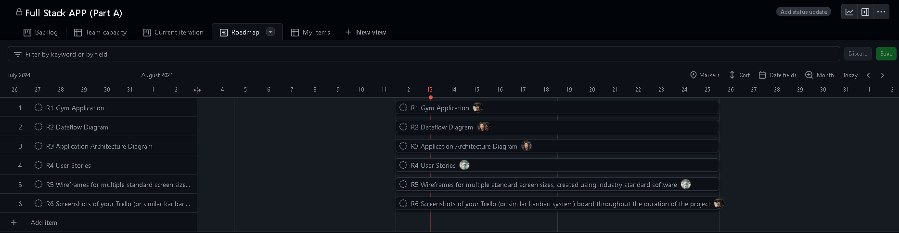

# GymFlow

Repository link: https://github.com/nlina-0/T3A2-B_FullStackApp 

Deployed website: https://main--gymflow101.netlify.app/ 

Login for website:

    Email: testmaster@gym.com
    Password: masterpassword123

  

# FUNCTIONALITY AND FEATURES

### Application Purpose

This application is designed to streamline the management of gym classes, coaches and customer enrollment. It will cater for both the gym staff and the customers, offering the necessary tools for class management, user enrollment and specific class scheduling. The application will ensure a user friendly experience with secure authentication and a variety of features aimed at improving the all round efficiency of the gyms operations.

### Functionality/Features

1. User login/authentication
    - (MVP) Create users/edit user details.
    - (MVP) Gym staff members can make changes in the app: e.g. edit customer  instructor details, add attendees to classes, etc.
    - (MVP) Customers have read access to class times and search functionality.
    - (Stretch) Allow customers to enrol themselves into classes.

2. Class details (MVP)
    - Details of all types of classes offered at the gym
    Class type, time, instructor, maximum class capacity, attendees (customers)
    - Ability to update/edit/remove classes and details

    Teacher details (MVP)
    Name.
    Class types.

3. Customer details (MVP)
    - Name.
    - Age.
    - Contact.

4. Booking functionality (MVP)
    - Create instances of gym classes and enrol customers into classes.
    - Search functionality (MVP).
    - Search available classes by class type or instructor.

5. Class schedule dashboard (Stretch)
    - Display a week view of all classes (and its details) available in the specified week.

## Target Audience

### Gym Staff/administrators
Gym owners, managers and any staff that need to manage the daily operations of classes, user information, particular instructor duties and any customer interactions.

### Gym Customers
Will allow for members of the gym to view class schedules, search for specific classes or instructors, and then enrol in classes(stretch).

## Tech Stack

### Frontend:

- React.js (Dynamic and responsive user interface)
- CSS/Bulma (For a pleasing and polished user-friendly design.)
- JWT (For secure authentication and Authorization)

### Backend:

- Node.js & Express ( Handles API requests and managing any business logic)
- MongoDB (For handling/managing data related to users, instructors, classes and bookings.)
 
### Deployment Hosting

- Render (Deployment of backend)
- Netfliy (Deployment of frontend)

  
## DATAFLOW DIAGRAM

### Entire Gym Application Data flow Diagram

### Creating User Data Flow Diagram 

### Class View/Management Data flow Diagram

### Class Creation and Enrollment Diagram

  
## APPLICATION ARCHITECTURE DIAGRAM

This application is created using the MERN stack, i.e. the main technologies used are MongoDB, Express.js, React.js and Node.js. This stack is commonly used to develop web applications and suits the purpose of our gym class management application. The high-level application architecture diagram above maps out each component of the application and how they fit together and interact with each other.

**User:** the user interacts with the web application through their browsers on their device (mobile, tablet, desktop).

**Front-end:** responsible for the user interface (UI) and experience (UX), React.js has been utilised for its ability to create dynamic and interactive webpages with ease. It performs several roles including rendering the UI, managing application state, handling user interactions and events and communicating with the server via HTTP requests in order to fetch or send data to the server. Bulma, a CSS framework, has also been utilised in the front-end to help in building a responsive web interface.

**Back-end:** responsible for handling routing, business logic and interactions with the database, Node.js and Express.js have been used together for the web server. Node.js provides the runtime environment, and Express.js is a web framework that creates RESTful APIs. The web server receives HTTP requests from the client (React.js frontend), processes these requests, interacts with the MongoDB database, and sends responses back to the client. Mongoose, an object document mapper (ODM), is used to provide an interface for interactions between the Node.js web server and MongoDB through relationship management, schemas and translation of objects in code to their database representations. Some of the responsibilities of the back-end include defining API routes and handling requests from the client, performing server-side logic and data processing and validation and sanitisation of input data. 

**Database:** the component that stores and manages the app’s data and allows for CRUD functionalities. MongoDB is a NoSQL (non-relational) database and has been chosen for the flexibility it offers in storing data in a JSON-like format. It retrieves or stores data according to API requests received from the Node.js server.

  
## USER STORIES

### Revision 1.

- As a gym staff or customer, I want a comprehensive application that streamlines the management of gym classes, instructors, and customer enrollment, so that the entire process is efficient, user-friendly, and secure.

- As a gym staff, I want an integrated management and booking tool, so that I can streamline daily operations, optimise class scheduling, and improve overall gym efficiency.

- As a customer, I want to see all fitness classes offered by the gym, so that I can choose ones that best suit my fitness goals and schedule. 

___

### Revision 2.

### Persona 1: Gym Staff/administrators

As gym staff, I want to effectively communicate the schedule and details of fitness classes to customers, so that they can easily discover and attend classes that align with their fitness goals, leading to a more engaging and successful fitness journey.

| Acceptance Criteria | Design Considerations |
| --- | --- |
| <ul><li>The system must display a comprehensive list of upcoming classes that include details such as class name, instructor, date, time, and duration.</li><li>Users must be able to search for classes by keywords, instructor names, or class types.</li><li>The class schedule and details must be accessible and fully functional on various devices, including desktops, tablets, and smartphones.</li>     <li>Any changes to the class schedule or details should be updated in real-time to ensure users have the most current information.</li></ul>| <ul><li>Use consistent typography and colour schemes to enhance readability and ensure important information stands out.</li><li>Implement easy-to-use search and filter controls, ensuring they are prominently placed and user-friendly.</li><li>Ensure that the class details page is well-organised, with a focus on key information such as schedule, instructor details, and class description.</li></ul>|

As gym staff, I want to display class availability to customers, so that they are informed of the remaining spaces and can secure a spot before classes fill up.

| Acceptance Criteria | Design Considerations |
| --- | --- |
|<ul><li>The system must show the number of remaining spots for each class on the class schedule or details page.</li><li>Availability should be updated in real-time to reflect current reservations and cancellations.</li></ul>| <ul><li>Design a clear and intuitive layout for displaying availability, using clear visual indicators like badges or labels.</li></ul>

As gym staff, I want to coordinate and schedule classes with various instructors, so that the gym can offer a diverse range of classes to meet the varying interests and fitness levels of our members.

|
 Acceptance Criteria 
| 
 Design Considerations 
|
| --- | --- |
|<ul><li>The system must allow the gym manager to create, edit, and delete class schedules.</li><li>Managers should be able to view and manage instructor schedules to avoid conflicts.</li></ul>|<ul><li>Implement a scheduling tool that allows managers to easily assign and manage instructors, including a calendar or timetable view of instructor availability.</li></ul>|

As gym staff, I want to manage and book attendees for each class, so that I can ensure optimal class sizes, track attendance, and maximise member satisfaction while efficiently utilising resources.

| Acceptance Criteria | Design Considerations |
| --- | --- |
|<ul><li>The system must allow the gym manager to view and manage bookings for each class.</li><li>Managers should be able to set and modify class capacity limits.</li><li>The system should handle booking requests in real-time and prevent overbooking.</li></ul>|<ul><li>Design an intuitive booking management interface with a clear overview of class schedules, capacities, and current bookings.</li></ul>|

As gym staff, I want to maintain an up-to-date record of all gym members, so that I can accurately track their attendance and engagement.

| Acceptance Criteria | Design Considerations |
| --- | --- |
|<ul><li>The system must allow the creation, updating, and deletion of member records.</li><li>Each member record should include key details such as name, age and contact information.</li></ul>|<ul><li>Design a clear and intuitive interface for managing and viewing member records, attendance, and engagement data.</li><li>Include easy-to-use search, filter, and sorting options to navigate through large volumes of data.</li></ul>|

### Persona 2: Customer

As a gym customer, I want to view a comprehensive list of all fitness classes offered at the gym, so that I can easily find and choose classes that match my interests and schedule.

| Acceptance Criteria | Design Considerations |
| --- | --- |
|<ul><li>The system displays a comprehensive list of all available fitness classes.</li><li>Each class listing includes details such as class name, instructor, time, and availability.</li><li>Users can search for specific classes or instructors.</li><li>The interface is responsive and accessible on both desktop and mobile devices.</li></ul>|<ul><li>Use a clean, grid-based layout to display class information.</li><li>Implement filters and search functionality in a prominent location.</li><li>Ensure that class details are easily readable with clear typography.</li><li>Incorporate visual indicators for class availability (e.g., “Full” or “Available”).</li></ul>|

As a gym customer, I want to conveniently book classes online, so that I can reserve my spot in advance and ensure I don’t miss out on my preferred sessions.

| Acceptance Criteria | Design Considerations |
| --- | --- |
|<ul><li>Users can select a class from the class listing and proceed to booking.</li><li>The booking interface allows users to confirm their spot and receive a booking confirmation.</li><li>The system updates class availability in real-time.</li></ul>|<ul><li>Provide a clear and straightforward booking button on the class details page.</li><li>Use a step-by-step booking process with progress indicators.</li><li>Ensure that confirmation messages and notifications are clear and informative.</li><li>Implement error handling for booking conflicts or issues.</li></ul>|

  
## WIREFRAMES

**User login/authentication:** User can login and sign up to web application. Once user has been authenticated, they will have access to a navigation that provides access to all features.
 

**Home page:** Users on the desktop will land on the class search functionality as the homepage. Users on mobile will land on a menu page. 

**Classes:** Users can select a class from the home page and will be taken to class details, where class can be edited. Attendees for the class can be added on this page. Classes can be created at any point via the navigation bar.

**Customer Records**: User can access customer list via navigation bar at any time. Customers can be added, edited or removed.

**Customer Access:** Customers will only have the ability to search and read class options.

## PROJECT MANAGEMENT
### Github Projects Collaboration Screenshots

